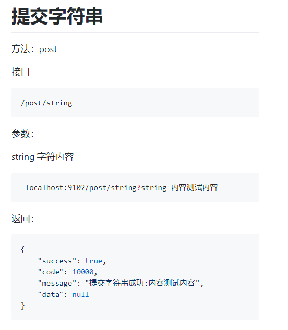
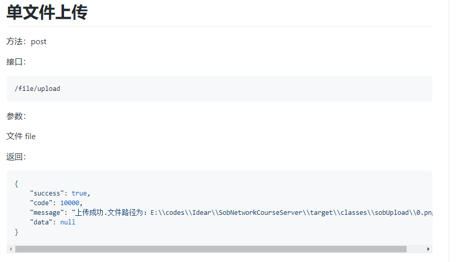
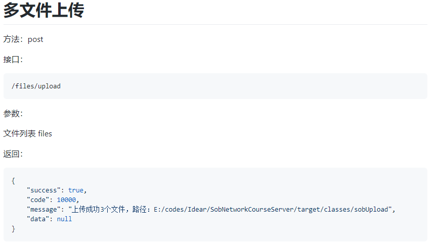
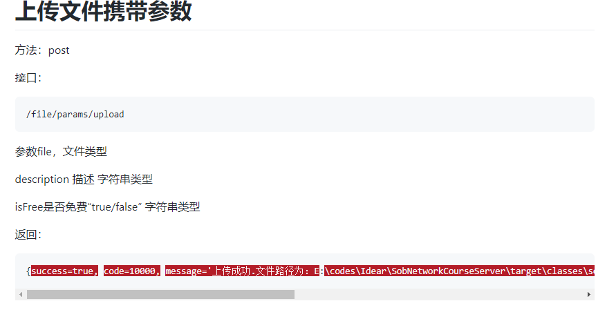
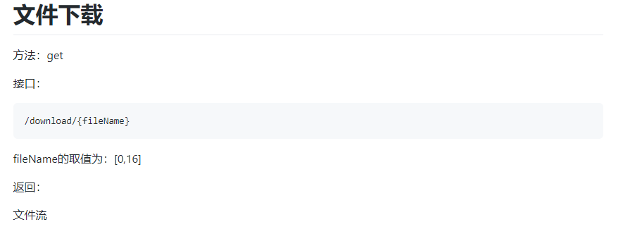
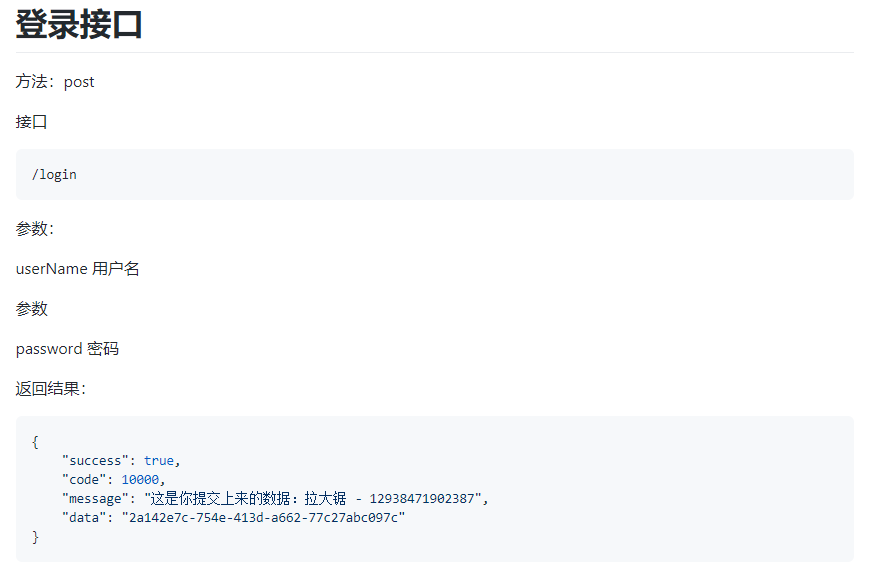

# Retrofit

### 关于高版本(27以上)http访问的配置

如果访问为https协议的话，略过即可

如果在android27以上，默认是不支持Http访问的了，需要使用https，如果你要使用Http明文访问，那么需要配置一下。

在清单文件，application节点，添加

```xml
android:networkSecurityConfig="@xml/network_security_config"
```

network_security_config

```xml
<?xml version="1.0" encoding="utf-8"?>
<network-security-config>
    <domain-config>
        <domain includeSubdomains="true">sunofbeaches.com</domain>
        <domain-config cleartextTrafficPermitted="true">
            <domain includeSubdomains="true">www.sunofbeach.net</domain>
            <domain includeSubdomains="true">imgs.sunofbeaches.com</domain>
        </domain-config>
    </domain-config>
</network-security-config>
```

使用网络需添加网络权限

```
<uses-permission android:name="android.permission.INTERNET" />
```


### 添加依赖

```java
//图片框架
implementation 'com.github.bumptech.glide:glide:4.11.0' 
annotationProcessor 'com.github.bumptech.glide:compiler:4.11.0'
//retrofit
implementation group: 'com.squareup.retrofit2', name: 'retrofit', version: '2.9.0'
//转换器
implementation 'com.squareup.retrofit2:converter-gson:2.9.0'
```


### 入门代码

1.先定义一个接口(Get请求)

```java
public interface API {

    @GET("/get/text")
    Call<GetTextItem> getJson();
}
```

2.定义结果bean类

bean类代码比较多，我就不帖出来了。使用gsonFormat自动生成，而结果的json数据样例可以在前面的接口文档里看到。

3.创建retrofit

`请求 http://localhost:9102/get/text`

```java
Retrofit retrofit = new Retrofit.Builder()
                .baseUrl("http:10.0.2.2:9102")
                .addConverterFactory(GsonConverterFactory.create())
                .build();
API api = RetrofitManager.getRetrofit().create(API.class);
//使用对象方法获得Call对象
Call<GetTextItem> task = api.getJson();
task.enqueue(new Callback<GetTextItem>() {
    @Override
    public void onResponse(Call<GetTextItem> call, Response<GetTextItem> response) {
        Log.d(TAG, "onResponse === " + response.code());
        if (response.code() == HttpURLConnection.HTTP_OK) {
            GetTextItem body = response.body();
            updateList(body);
        }
    }
    @Override
    public void onFailure(Call<GetTextItem> call, Throwable t) {
        Log.d(TAG, "onFailure: " + t.getMessage());
    }
});
```


### 封装

```java
public class RetrofitManager {
    //使用Builder模式实例化Retrofit对象
    public static Retrofit retrofit = new Retrofit.Builder()
            .baseUrl(Constants.BASE_URL)
            .addConverterFactory(GsonConverterFactory.create())  //json数据映射为实体类
            .build();

    public static Retrofit getRetrofit(){
        return retrofit;
    }
}
```


封装后使用:

```java
//使用Builder模式实例化Retrofit对象
//得到接口的对象,得到对象就可以使用对象的方法
API api = RetrofitManager.getRetrofit().create(API.class);
//使用对象方法获得Call对象
Call<GetTextItem> task = api.getJson();
task.enqueue(new Callback<GetTextItem>() {
    @Override
    public void onResponse(Call<GetTextItem> call, Response<GetTextItem> response) {
        Log.d(TAG, "onResponse === " + response.code());
        if (response.code() == HttpURLConnection.HTTP_OK) {
            GetTextItem body = response.body();
            updateList(body);
        }

    }

    @Override
    public void onFailure(Call<GetTextItem> call, Throwable t) {
        Log.d(TAG, "onFailure: " + t.getMessage());
    }
});
```

### 

### get请求

##### 带参数get请求

```
/get/param
```

参数:

- keyword 关键字
- page 页码
- order 0 顺序 1 逆序

接口定义：两种写法都可以

```java
@GET("/get/param")
    Call<GetWithParamsResult> getWithParams(
            @Query("keyword")String keyword,
            @Query("page")Integer page,
            @Query("order")String order);

    @GET("/get/param")
    Call<GetWithParamsResult> getWithParams(
            @QueryMap Map<String, Object> params);
```

调用:

```java
public void getWithParam_retrofit(View view) {
    API api = RetrofitManager.getRetrofit().create(API.class);
    Call<GetWithParamsResult> withParams = api.getWithParams("我是搜索关键字", 10, "0");
    withParams.enqueue(new Callback<GetWithParamsResult>() {
        @Override
        public void onResponse(Call<GetWithParamsResult> call, Response<GetWithParamsResult> response) {
            Log.d(TAG, "onResponse ===>>> " + response.body());
        }
        @Override
        public void onFailure(Call<GetWithParamsResult> call, Throwable t) {
            Log.d(TAG, "onFailure ===>>> " + t.getMessage());
        }
    });
}
```

或

```java
public void getWithParamMap_retrofit(View view) {
    API api = RetrofitManager.getRetrofit().create(API.class);
    Map<String, Object> params = new HashMap<>();
    params.put("keyword", "我是关键字");
    params.put("page", "10");
    params.put("order", "0");
    Call<GetWithParamsResult> withParams = api.getWithParams(params);
    withParams.enqueue(new Callback<GetWithParamsResult>() {
        @Override
        public void onResponse(Call<GetWithParamsResult> call, Response<GetWithParamsResult> response) {
            int code = response.code();
            Log.d(TAG, "code ===>>> " + code);
            if (code == HttpURLConnection.HTTP_OK) {
                Log.d(TAG, "onResponse ===>>> " + response.body());
            }
        }
        @Override
        public void onFailure(Call<GetWithParamsResult> call, Throwable t) {
            Log.d(TAG, "onFailure ===>>> " + t.getMessage());
        }
    });
}
```

结果

```
onResponse ===>>> GetWithParamsResult{success=true, code=10000, message='get带参数请求成功.', data=DataBean{page='10', keyword='我是搜索关键字', order='顺序'}}
```


### post请求

##### url后传参数



接口定义：

```java
@POST("/post/string")
Call<PostWithParamsResult> postWithParams(
        @Query("string")String content);
```

调用

```java
public void postWithParam_retrofit(View view) {
    API api = RetrofitManager.getRetrofit().create(API.class);

    Call<PostWithParamsResult> postWithParamsResultCall = api.postWithParams("太棒了！");

    postWithParamsResultCall.enqueue(new Callback<PostWithParamsResult>() {
        @Override
        public void onResponse(Call<PostWithParamsResult> call, Response<PostWithParamsResult> response) {
            int code = response.code();
            Log.d(TAG, "code ===>>> " + code);
            if (code == HttpURLConnection.HTTP_OK) {
                Log.d(TAG, "onResponse ===>>> " + response.body());
            }
        }

        @Override
        public void onFailure(Call<PostWithParamsResult> call, Throwable t) {
            Log.d(TAG, "onFailure ===>>> " + t.getMessage());
        }
    });

}
```

或者直接将url写在参数上

定义接口:

```java
@POST
Call<PostWithParamsResult> postWithUrl(@Url String url);
```

调用

```java
public void postWithUrl_retrofit(View view) {
    API api = RetrofitManager.getRetrofit().create(API.class);
    String url = Constants.BASE_URL + "/post/string" + "?string=内容测试内容";
    Call<PostWithParamsResult> task = api.postWithUrl(Constants.BASE_URL + "/post/string");
    task.enqueue(new Callback<PostWithParamsResult>() {
        @Override
        public void onResponse(Call<PostWithParamsResult> call, Response<PostWithParamsResult> response) {
            int code = response.code();
            Log.d(TAG, "code ===>>> " + code);
            if (code == HttpURLConnection.HTTP_OK) {
                Log.d(TAG, "onResponse ===>>> " + response.body());
            }
        }

        @Override
        public void onFailure(Call<PostWithParamsResult> call, Throwable t) {
            Log.d(TAG, "onFailure ===>>> " + t.getMessage());
        }
    });
}
```


##### 评论


定义接口:

```java
@POST("/post/comment")
    Call<PostWithParamsResult> postWithBody(@Body CommentItem commentItem);
```

调用

```java
public void postWithBody_retrofit(View view) {
        API api = RetrofitManager.getRetrofit().create(API.class);
        CommentItem commentItem = new CommentItem("1212","呵呵呵");
        Call<PostWithParamsResult> task = api.postWithBody(commentItem);
        task.enqueue(new Callback<PostWithParamsResult>() {
            @Override
            public void onResponse(Call<PostWithParamsResult> call, Response<PostWithParamsResult> response) {
                int code = response.code();
                Log.d(TAG, "code ===>>> " +code);
                if (code == HttpURLConnection.HTTP_OK) {
                    Log.d(TAG, "onResponse ===>>> " + response.body());
                }
            }

            @Override
            public void onFailure(Call<PostWithParamsResult> call, Throwable t) {
                Log.d(TAG, "onFailure ===>>> " + t.getMessage());
            }
        });

    }
```


### 文件上传


##### 单文件上传



接口定义:

```java
@Multipart
    @POST("/file/upload")
    Call<PostWithParamsResult> postFile(@Part MultipartBody.Part part);
```

调用

```java
public void postFile_retrofit(View view){
        API api = RetrofitManager.getRetrofit().create(API.class);
        //创建文件
        File file = new File("/sdcard/Download/timg.jpg");
        //解析这个文件为图片
        RequestBody body = RequestBody.create(MediaType.parse("image/jpeg"),file);
        //createFormData参数: 传入File类的名字，file文件的名字,RequestBody类
        MultipartBody.Part part = MultipartBody.Part.createFormData("file",file.getName(),body);
        Call<PostWithParamsResult> task = api.postFile(part);
        task.enqueue(new Callback<PostWithParamsResult>() {
            @Override
            public void onResponse(Call<PostWithParamsResult> call, Response<PostWithParamsResult> response) {
                int code = response.code();
                Log.d(TAG, "code ===>>> " +code);
                if (code == HttpURLConnection.HTTP_OK) {
                    Log.d(TAG, "onResponse ===>>> " + response.body());
                }
            }

            @Override
            public void onFailure(Call<PostWithParamsResult> call, Throwable t) {
                Log.d(TAG, "onFailure ===>>> " + t.getMessage());
            }
        });
    }
```


##### 多文件上传



定义接口：

```java
@Multipart
@POST("/files/upload")
Call<PostWithParamsResult> postFiles(@Part List<MultipartBody.Part> parts);
```

调用:

```java
public void postFiles_retrofit(View view){
    API api = RetrofitManager.getRetrofit().create(API.class);
    MultipartBody.Part part1 = MultipartBodyMethod("/sdcard/Download/timg.jpg","files");
    MultipartBody.Part part2 = MultipartBodyMethod("/sdcard/DCIM/Camera/IMG_20200809_042923.jpg","files");
    List<MultipartBody.Part> parts = new ArrayList<>();
    parts.add(part1);
    parts.add(part2);

    Call<PostWithParamsResult> task = api.postFiles(parts);
    task.enqueue(new Callback<PostWithParamsResult>() {
        @Override
        public void onResponse(Call<PostWithParamsResult> call, Response<PostWithParamsResult> response) {
            int code = response.code();
            Log.d(TAG, "code ===>>> " +code);
            if (code == HttpURLConnection.HTTP_OK) {
                Log.d(TAG, "onResponse ===>>> " + response.body());
            }
        }

        @Override
        public void onFailure(Call<PostWithParamsResult> call, Throwable t) {
            Log.d(TAG, "onFailure ===>>> " + t.getMessage());
        }
    });
}

//key为服务器接口中规定的文件列表
    private MultipartBody.Part MultipartBodyMethod(String filePath,String key) {
        File file = new File(filePath);
        RequestBody body = RequestBody.create(MediaType.parse("image/jpeg"),file);
        MultipartBody.Part part = MultipartBody.Part.createFormData(key, file.getName(), body);
        return part;
    }
```


##### 上传文件带参数



定义接口:

```java
@Multipart
@POST("/file/params/upload")
Call<PostWithParamsResult> postFileWithParams(@Part MultipartBody.Part part, @PartMap Map<String,String> params);
```

调用:

```java
public void postFileWithParams_retrofit(View view){
    API api = RetrofitManager.getRetrofit().create(API.class);
    MultipartBody.Part part1 = MultipartBodyMethod("/sdcard/Download/timg.jpg","file");
    Map<String, String> params = new HashMap<>();
    params.put("description","这是一张图片");
    params.put("isFree","true");
    Call<PostWithParamsResult> task = api.postFileWithParams(part1, params);
    task.enqueue(new Callback<PostWithParamsResult>() {
        @Override
        public void onResponse(Call<PostWithParamsResult> call, Response<PostWithParamsResult> response) {
            int code = response.code();
            Log.d(TAG, "code ===>>> " +code);
            if (code == HttpURLConnection.HTTP_OK) {
                Log.d(TAG, "onResponse ===>>> " + response.body());
            }
        }

        @Override
        public void onFailure(Call<PostWithParamsResult> call, Throwable t) {
            Log.d(TAG, "onFailure ===>>> " + t.getMessage());
        }
    });
}


//key为服务器接口中规定的文件列表
    private MultipartBody.Part MultipartBodyMethod(String filePath,String key) {
        File file = new File(filePath);
        RequestBody body = RequestBody.create(MediaType.parse("image/jpeg"),file);
        MultipartBody.Part part = MultipartBody.Part.createFormData(key, file.getName(), body);
        return part;
    }
```


### 文件下载



定义接口:

```java
@Streaming
@GET
Call<ResponseBody> downFile(@Url String url);
```

调用：

```java
public void downFile_retrofit(View view){
        API api = RetrofitManager.getRetrofit().create(API.class);
        String url = Constants.BASE_URL + "/download/8";
        Call<ResponseBody> task = api.downFile(url);
        task.enqueue(new Callback<ResponseBody>() {
            @Override
            public void onResponse(Call<ResponseBody> call, Response<ResponseBody> response) {
                int code = response.code();
                Log.d(TAG, "code ===>>> " + code);
                if (code == HttpURLConnection.HTTP_OK) {
                    Log.d(TAG, "thread name ===>>> " + Thread.currentThread().getName());
                    //拿出文件名 ---header里
                    String fileName = "未命名.png";
                    Headers headers = response.headers();
                    String fileNameHeader = headers.get("Content-disposition");
                    if (fileNameHeader != null) {
                        //String fileName = fileNameHeader.replace("attachment; filename=","");
                        Log.d(TAG, "fileName ===>>> " + fileName);
                    }

//                    for (int i = 0; i < headers.size(); i++) {
//                        String value = headers.value(i);
//                        String key = headers.name(i);
//                        Log.d(TAG, "key ===>>> " + key + "/value ===>>> " + value);
//                    }
                    //写文件，这里是ui线程不可写

                    writeString2Disk(response,fileName);

                }
            }

            @Override
            public void onFailure(Call<ResponseBody> call, Throwable t) {

            }
        });
    }

    private void writeString2Disk(Response<ResponseBody> response, String fileName) {
        new Thread(new Runnable() {
            @Override
            public void run() {
                InputStream inputStream = response.body().byteStream();
//                File exPath = Environment.getExternalStorageDirectory();
//                Log.d(TAG, "exPath ===>>> " + exPath);
                File baseOutFile = getExternalFilesDir(Environment.DIRECTORY_PICTURES);
                File outFile = new File(baseOutFile,fileName);
                Log.d(TAG, "outFile ===>>> " + outFile);
                try {
                    FileOutputStream fos = new FileOutputStream(outFile);
                    byte[] buffer = new byte[1024];
                    int len;
                    while ((len = inputStream.read(buffer))!=-1){
                        fos.write(buffer,0,len);
                    }
                    fos.close();
                } catch (Exception e) {
                    e.printStackTrace();
                }
            }
        }).start();
    }
```


### 提交表单



##### 参数提交表单

定义接口:

```
@FormUrlEncoded
@POST("/login")
Call<PostWithParamsResult> dologin(@Field("userName")String userName,@Field("password")String word);
```

调用:

```java
public void doLogin_retrofit(View view){
    API api = RetrofitManager.getRetrofit().create(API.class);

    Call<PostWithParamsResult> task = api.dologin("cjc", "123456");
    task.enqueue(new Callback<PostWithParamsResult>() {
        @Override
        public void onResponse(Call<PostWithParamsResult> call, Response<PostWithParamsResult> response) {
            int code = response.code();
            Log.d(TAG, "code ===>>> " +code);
            if (code == HttpURLConnection.HTTP_OK) {
                Log.d(TAG, "onResponse ===>>> " + response.body());
            }
        }

        @Override
        public void onFailure(Call<PostWithParamsResult> call, Throwable t) {
            Log.d(TAG, "onFailure ===>>> " + t.getMessage());
        }
    });
}
```


##### Map提交表单

定义接口:

```java
@FormUrlEncoded
@POST("/login")
Call<PostWithParamsResult> dologin(@FieldMap Map<String,String> params);
```

调用:

```java
public void doLogin_Map_retrofit(View view){
    API api = RetrofitManager.getRetrofit().create(API.class);
    Map<String,String> params = new HashMap<>();
    params.put("userName","cjc1");
    params.put("password","123");
    Call<PostWithParamsResult> task = api.dologin(params);
    task.enqueue(new Callback<PostWithParamsResult>() {
        @Override
        public void onResponse(Call<PostWithParamsResult> call, Response<PostWithParamsResult> response) {
            int code = response.code();
            Log.d(TAG, "code ===>>> " +code);
            if (code == HttpURLConnection.HTTP_OK) {
                Log.d(TAG, "onResponse ===>>> " + response.body());
            }
        }

        @Override
        public void onFailure(Call<PostWithParamsResult> call, Throwable t) {
            Log.d(TAG, "onFailure ===>>> " + t.getMessage());
        }
    });
}
```


>代码参考：阳光沙滩-程序猿拉大锯

[阳光沙滩](https://www.sunofbeach.net/)

[程序猿拉大锯的bilibili空间](https://space.bilibili.com/44272436)