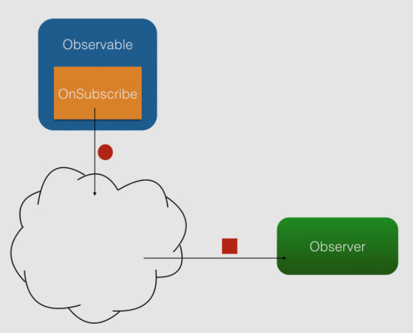
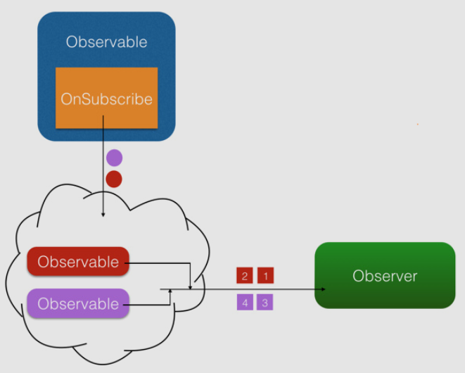

# RxJava

#### 1. 概念：扩展的观察者模式

OnClickListener 的模式大致如下图：


如图所示，通过 `setOnClickListener()` 方法，`Button` 持有 `OnClickListener` 的引用（这一过程没有在图上画出）；当用户点击时，`Button` 自动调用 `OnClickListener` 的 `onClick()` 方法。另外，如果把这张图中的概念抽象出来（`Button` -> 被观察者、`OnClickListener` -> 观察者、`setOnClickListener()` -> 订阅，`onClick()` -> 事件），就由专用的观察者模式（例如只用于监听控件点击）转变成了通用的观察者模式。如下图：


而 RxJava 作为一个工具库，使用的就是通用形式的观察者模式。

##### RxJava 的观察者模式

RxJava 有四个基本概念：`Observable` (可观察者，即被观察者)、 `Observer` (观察者)、 `subscribe` (订阅)、事件。`Observable` 和 `Observer` 通过 `subscribe()` 方法实现订阅关系，从而 `Observable` 可以在需要的时候发出事件来通知 `Observer`。

与传统观察者模式不同， RxJava 的事件回调方法除了普通事件 `onNext()` （相当于 `onClick()` / `onEvent()`）之外，还定义了两个特殊的事件：`onCompleted()` 和 `onError()`。

RxJava 的观察者模式大致如下图：


#### 2. 基本实现

##### 1) 创建 Observer

Observer/Subscriber 即观察者，它决定事件触发的时候将有怎样的行为。 RxJava 中的 `Observer` 接口的实现方式：

```java
Observer<String> observer = new Observer<String>() {
    @Override
    public void onNext(String s) {
        Log.d(tag, "Item: " + s);
    }

    @Override
    public void onCompleted() {
        Log.d(tag, "Completed!");
    }

    @Override
    public void onError(Throwable e) {
        Log.d(tag, "Error!");
    }
};
```

1. `onStart()`: 这是 `Subscriber` 增加的方法。它会在 subscribe 刚开始，而事件还未发送之前被调用，可以用于做一些准备工作，例如数据的清零或重置。这是一个可选方法，默认情况下它的实现为空。需要注意的是，如果对准备工作的线程有要求（例如弹出一个显示进度的对话框，这必须在主线程执行）， `onStart()` 就不适用了，因为它总是在 subscribe 所发生的线程被调用，而不能指定线程。要在指定的线程来做准备工作，可以使用 `doOnSubscribe()` 方法，具体可以在后面的文中看到。
2. `unsubscribe()`: 这是 `Subscriber` 所实现的另一个接口 `Subscription` 的方法，用于取消订阅。在这个方法被调用后，`Subscriber` 将不再接收事件。一般在这个方法调用前，可以使用 `isUnsubscribed()` 先判断一下状态。 `unsubscribe()` 这个方法很重要，因为在 `subscribe()` 之后， `Observable` 会持有 `Subscriber` 的引用，这个引用如果不能及时被释放，将有内存泄露的风险。所以最好保持一个原则：要在不再使用的时候尽快在合适的地方（例如 `onPause()` `onStop()` 等方法中）调用 `unsubscribe()` 来解除引用关系，以避免内存泄露的发生。


##### 2) 创建 Observable

Observable 即被观察者，它决定什么时候触发事件以及触发怎样的事件。 RxJava 使用 `create()` 方法来创建一个 Observable ，并为它定义事件触发规则：

```java
Observable observable = Observable.create(new Observable.OnSubscribe<String>() {
    @Override
    public void call(Subscriber<? super String> subscriber) {
        subscriber.onNext("Hello");
        subscriber.onNext("Hi");
        subscriber.onNext("Aloha");
        subscriber.onCompleted();
    }
});
```

可以看到，这里传入了一个 `OnSubscribe` 对象作为参数。`OnSubscribe` 会被存储在返回的 `Observable` 对象中，它的作用相当于一个计划表，当 `Observable` 被订阅的时候，`OnSubscribe` 的 `call()` 方法会自动被调用，事件序列就会依照设定依次触发（对于上面的代码，就是观察者`Subscriber` 将会被调用三次 `onNext()` 和一次 `onCompleted()`）。这样，由被观察者调用了观察者的回调方法，就实现了由被观察者向观察者的事件传递，即观察者模式。


`create()` 方法是 RxJava 最基本的创造事件序列的方法。基于这个方法， RxJava 还提供了一些方法用来快捷创建事件队列，例如：

- `just(T...)`: 将传入的参数依次发送出来。

```java
Observable observable = Observable.just("Hello", "Hi", "Aloha");
// 将会依次调用：
// onNext("Hello");
// onNext("Hi");
// onNext("Aloha");
// onCompleted();
```

- `from(T[])` / `from(Iterable<? extends T>)` : 将传入的数组或 `Iterable` 拆分成具体对象后，依次发送出来。

```java
String[] words = {"Hello", "Hi", "Aloha"};
Observable observable = Observable.from(words);
// 将会依次调用：
// onNext("Hello");
// onNext("Hi");
// onNext("Aloha");
// onCompleted();
```

上面 `just(T...)` 的例子和 `from(T[])` 的例子，都和之前的 `create(OnSubscribe)` 的例子是等价的。


##### 3) Subscribe (订阅)

创建了 `Observable` 和 `Observer` 之后，再用 `subscribe()` 方法将它们联结起来，整条链子就可以工作了。代码形式很简单：

```java
observable.subscribe(observer);
// 或者：
observable.subscribe(subscriber);
```


除了 `subscribe(Observer)` 和 `subscribe(Subscriber)` ，`subscribe()` 还支持不完整定义的回调，RxJava 会自动根据定义创建出 `Subscriber` 。形式如下：

```java
Action1<String> onNextAction = new Action1<String>() {
    // onNext()
    @Override
    public void call(String s) {
        Log.d(tag, s);
    }
};
Action1<Throwable> onErrorAction = new Action1<Throwable>() {
    // onError()
    @Override
    public void call(Throwable throwable) {
        // Error handling
    }
};
Action0 onCompletedAction = new Action0() {
    // onCompleted()
    @Override
    public void call() {
        Log.d(tag, "completed");
    }
};

// 自动创建 Subscriber ，并使用 onNextAction 来定义 onNext()
observable.subscribe(onNextAction);
// 自动创建 Subscriber ，并使用 onNextAction 和 onErrorAction 来定义 onNext() 和 onError()
observable.subscribe(onNextAction, onErrorAction);
// 自动创建 Subscriber ，并使用 onNextAction、 onErrorAction 和 onCompletedAction 来定义 onNext()、 onError() 和 onCompleted()
observable.subscribe(onNextAction, onErrorAction, onCompletedAction);
```

简单解释一下这段代码中出现的 `Action1` 和 `Action0`。 `Action0` 是 RxJava 的一个接口，它只有一个方法 `call()`，这个方法是无参无返回值的；由于 `onCompleted()` 方法也是无参无返回值的，因此 `Action0` 可以被当成一个包装对象，将 `onCompleted()` 的内容打包起来将自己作为一个参数传入 `subscribe()` 以实现不完整定义的回调。这样其实也可以看做将 `onCompleted()`方法作为参数传进了 `subscribe()`，相当于其他某些语言中的『闭包』。 `Action1` 也是一个接口，它同样只有一个方法 `call(T param)`，这个方法也无返回值，但有一个参数；与 `Action0` 同理，由于 `onNext(T obj)` 和 `onError(Throwable error)` 也是单参数无返回值的，因此 `Action1` 可以将 `onNext(obj)` 和 `onError(error)` 打包起来传入 `subscribe()` 以实现不完整定义的回调。事实上，虽然 `Action0` 和 `Action1` 在 API 中使用最广泛，但 RxJava 是提供了多个 `ActionX` 形式的接口 (例如 `Action2`, `Action3`) 的，它们可以被用以包装不同的无返回值的方法。


##### 4) 场景示例

下面举两个例子：

> 为了把原理用更清晰的方式表述出来，本文中挑选的都是功能尽可能简单的例子，以至于有些示例代码看起来会有『画蛇添足』『明明不用 RxJava 可以更简便地解决问题』的感觉。当你看到这种情况，不要觉得是因为 RxJava 太啰嗦，而是因为在过早的时候举出真实场景的例子并不利于原理的解析，因此我刻意挑选了简单的情景。

###### a. 打印字符串数组

将字符串数组 `names` 中的所有字符串依次打印出来：

```java
String[] names = ...;
Observable.from(names)
    .subscribe(new Action1<String>() {
        @Override
        public void call(String name) {
            Log.d(tag, name);
        }
    });
```

###### b. 由 id 取得图片并显示

由指定的一个 drawable 文件 id `drawableRes` 取得图片，并显示在 `ImageView` 中，并在出现异常的时候打印 Toast 报错：

```java
int drawableRes = ...;
ImageView imageView = ...;
Observable.create(new OnSubscribe<Drawable>() {
    @Override
    public void call(Subscriber<? super Drawable> subscriber) {
        Drawable drawable = getTheme().getDrawable(drawableRes));
        subscriber.onNext(drawable);
        subscriber.onCompleted();
    }
}).subscribe(new Observer<Drawable>() {
    @Override
    public void onNext(Drawable drawable) {
        imageView.setImageDrawable(drawable);
    }

    @Override
    public void onCompleted() {
    }
 
    @Override
    public void onError(Throwable e) {
        Toast.makeText(activity, "Error!", Toast.LENGTH_SHORT).show();
    }
});
```


#### 3. 线程控制 —— Scheduler (一)

在不指定线程的情况下， RxJava 遵循的是线程不变的原则，即：在哪个线程调用 `subscribe()`，就在哪个线程生产事件；在哪个线程生产事件，就在哪个线程消费事件。如果需要切换线程，就需要用到 `Scheduler` （调度器）。


##### 1) Scheduler 的 API (一)

在RxJava 中，`Scheduler` ——调度器，相当于线程控制器，RxJava 通过它来指定每一段代码应该运行在什么样的线程。RxJava 已经内置了几个 `Scheduler` ，它们已经适合大多数的使用场景：

- `Schedulers.immediate()`: 直接在当前线程运行，相当于不指定线程。这是默认的 `Scheduler`。
- `Schedulers.newThread()`: 总是启用新线程，并在新线程执行操作。
- `Schedulers.io()`: I/O 操作（读写文件、读写数据库、网络信息交互等）所使用的 `Scheduler`。行为模式和 `newThread()` 差不多，区别在于 `io()` 的内部实现是是用一个无数量上限的线程池，可以重用空闲的线程，因此多数情况下 `io()` 比 `newThread()` 更有效率。不要把计算工作放在 `io()` 中，可以避免创建不必要的线程。
- `Schedulers.computation()`: 计算所使用的 `Scheduler`。这个计算指的是 CPU 密集型计算，即不会被 I/O 等操作限制性能的操作，例如图形的计算。这个 `Scheduler` 使用的固定的线程池，大小为 CPU 核数。不要把 I/O 操作放在 `computation()` 中，否则 I/O 操作的等待时间会浪费 CPU。
- 另外， Android 还有一个专用的 `AndroidSchedulers.mainThread()`，它指定的操作将在 Android 主线程运行。


#### 4. 变换

##### 1) API

首先看一个 `map()` 的例子：

```java
Observable.just("images/logo.png") // 输入类型 String
    .map(new Func1<String, Bitmap>() {
        @Override
        public Bitmap call(String filePath) { // 参数类型 String
            return getBitmapFromPath(filePath); // 返回类型 Bitmap
        }
    })
    .subscribe(new Action1<Bitmap>() {
        @Override
        public void call(Bitmap bitmap) { // 参数类型 Bitmap
            showBitmap(bitmap);
        }
    });
```


这里出现了一个叫做 `Func1` 的类。它和 `Action1` 非常相似，也是 RxJava 的一个接口，用于包装含有一个参数的方法。 `Func1` 和 `Action` 的区别在于， `Func1` 包装的是有返回值的方法。另外，和 `ActionX` 一样， `FuncX` 也有多个，用于不同参数个数的方法。`FuncX` 和 `ActionX` 的区别在 `FuncX` 包装的是有返回值的方法。

可以看到，`map()` 方法将参数中的 `String` 对象转换成一个 `Bitmap` 对象后返回，而在经过 `map()` 方法后，事件的参数类型也由 `String` 转为了 `Bitmap`。这种直接变换对象并返回的，是最常见的也最容易理解的变换。不过 RxJava 的变换远不止这样，它不仅可以针对事件对象，还可以针对整个事件队列，这使得 RxJava 变得非常灵活。我列举几个常用的变换：

- `map()`: 事件对象的直接变换，具体功能上面已经介绍过。它是 RxJava 最常用的变换。  `map()` 的示意图： 
- 
- `flatMap()`: 这是一个很有用但**非常难理解**的变换，因此我决定花多些篇幅来介绍它。 首先假设这么一种需求：假设有一个数据结构『学生』，现在需要打印出一组学生的名字。实现方式很简单：

```java
Student[] students = ...;
Subscriber<String> subscriber = new Subscriber<String>() {
    @Override
    public void onNext(String name) {
        Log.d(tag, name);
    }
    ...
};
Observable.from(students)
    .map(new Func1<Student, String>() {
        @Override
        public String call(Student student) {
            return student.getName();
        }
    })
    .subscribe(subscriber);
```

 很简单。那么再假设：如果要打印出每个学生所需要修的所有课程的名称呢？（需求的区别在于，每个学生只有一个名字，但却有多个课程。）首先可以这样实现：

```java
Student[] students = ...;
Subscriber<Student> subscriber = new Subscriber<Student>() {
    @Override
    public void onNext(Student student) {
        List<Course> courses = student.getCourses();
        for (int i = 0; i < courses.size(); i++) {
            Course course = courses.get(i);
            Log.d(tag, course.getName());
        }
    }
    ...
};
Observable.from(students)
    .subscribe(subscriber);
```

 依然很简单。那么如果我不想在 `Subscriber` 中使用 for 循环，而是希望 `Subscriber` 中直接传入单个的 `Course` 对象呢（这对于代码复用很重要）？用 `map()` 显然是不行的，因为 `map()` 是一对一的转化，而我现在的要求是一对多的转化。那怎么才能把一个 Student 转化成多个 Course 呢？

 这个时候，就需要用 `flatMap()` 了：

```java
Student[] students = ...;
Subscriber<Course> subscriber = new Subscriber<Course>() {
    @Override
    public void onNext(Course course) {
        Log.d(tag, course.getName());
    }
    ...
};
Observable.from(students)
    .flatMap(new Func1<Student, Observable<Course>>() {
        @Override
        public Observable<Course> call(Student student) {
            return Observable.from(student.getCourses());
        }
    })
    .subscribe(subscriber);
```

 从上面的代码可以看出， `flatMap()` 和 `map()` 有一个相同点：它也是把传入的参数转化之后返回另一个对象。但需要注意，和 `map()` 不同的是， `flatMap()` 中返回的是个 `Observable` 对象，并且这个 `Observable` 对象并不是被直接发送到了 `Subscriber` 的回调方法中。 `flatMap()` 的原理是这样的：1. 使用传入的事件对象创建一个 `Observable` 对象；2. 并不发送这个 `Observable`, 而是将它激活，于是它开始发送事件；3. 每一个创建出来的 `Observable` 发送的事件，都被汇入同一个 `Observable` ，而这个 `Observable` 负责将这些事件统一交给 `Subscriber` 的回调方法。这三个步骤，把事件拆成了两级，通过一组新创建的 `Observable` 将初始的对象『铺平』之后通过统一路径分发了下去。而这个『铺平』就是 `flatMap()` 所谓的 flat。

 `flatMap()` 示意图：



扩展：由于可以在嵌套的 `Observable` 中添加异步代码， `flatMap()` 也常用于嵌套的异步操作，例如嵌套的网络请求。示例代码（Retrofit + RxJava）：

```java
networkClient.token() // 返回 Observable<String>，在订阅时请求 token，并在响应后发送 token
    .flatMap(new Func1<String, Observable<Messages>>() {
        @Override
        public Observable<Messages> call(String token) {
            // 返回 Observable<Messages>，在订阅时请求消息列表，并在响应后发送请求到的消息列表
            return networkClient.messages();
        }
    })
    .subscribe(new Action1<Messages>() {
        @Override
        public void call(Messages messages) {
            // 处理显示消息列表
            showMessages(messages);
        }
    });
```

 传统的嵌套请求需要使用嵌套的 Callback 来实现。而通过 `flatMap()` ，可以把嵌套的请求写在一条链中，从而保持程序逻辑的清晰。

- `throttleFirst()`: 在每次事件触发后的一定时间间隔内丢弃新的事件。常用作去抖动过滤，例如按钮的点击监听器：`RxView.clickEvents(button) // RxBinding 代码，后面的文章有解释   .throttleFirst(500, TimeUnit.MILLISECONDS) // 设置防抖间隔为 500ms   .subscribe(subscriber);`  妈妈再也不怕我的用户手抖点开两个重复的界面啦。