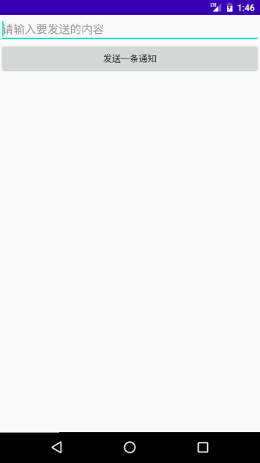

# 四大组件-广播

## 一.广播接收者

#### 1.监听电量，电量百分比以及是否充电(动态注册广播接收者)

动态注册广播接收者即通过`intentFilter.addAction()`并设置频道

添加权限`<uses-permission android:name="android.permission.BATTERY_STATS"/>`

```java
/*
* 1.创建一个广播接收者
* */
private class BatteryLevelReceiver extends BroadcastReceiver{

    @Override
    public void onReceive(Context context, Intent intent) {
        String action = intent.getAction();
        if (Intent.ACTION_BATTERY_CHANGED.equals(action)) {
            int currentlevel = intent.getIntExtra(BatteryManager.EXTRA_LEVEL, 0);
            int maxlevel = intent.getIntExtra(BatteryManager.EXTRA_SCALE, 0);
            double present = currentlevel * 1.0 / maxlevel * 100;

            tv_batterylevel.setText("当前电量=" + currentlevel + "当前电量百分比是=" + present);
            //Log.d(TAG, "action is ===>>> " + action);
            Log.d(TAG, "当前电量 ===>>> " + currentlevel);
        }else if(Intent.ACTION_POWER_CONNECTED.equals(action)){
            Log.d(TAG, "usb已连接");
            //Log.d(TAG, "action is ===>>> " + action);
        }else if (Intent.ACTION_POWER_DISCONNECTED.equals(action)){
            Log.d(TAG, "usb断开了");
            //Log.d(TAG, "action is ===>>> " + action);
        }
        Log.d(TAG, "action is ===>>>=== " + action);


    }
}
```


```java
		//这种注册方式是动态注册
        //收听的频道是：电量变化
        //2.意图
        IntentFilter intentFilter = new IntentFilter();
        //3.设置频道
        intentFilter.addAction(Intent.ACTION_BATTERY_CHANGED);
        intentFilter.addAction(Intent.ACTION_POWER_CONNECTED);
        intentFilter.addAction(Intent.ACTION_POWER_DISCONNECTED);
        //4.初始化广播接收者
        batteryLevelReceiver = new BatteryLevelReceiver();
        //5.注册广播
        this.registerReceiver(batteryLevelReceiver,intentFilter);
```


```java
//5.取消广播注册
@Override
protected void onDestroy() {
    super.onDestroy();
    //取消广播注册，否则会内存泄露
    if (batteryLevelReceiver != null) {
        this.unregisterReceiver(batteryLevelReceiver);
        Log.d(TAG, "已取消广播注册");
    }
}
```


#### 2.监听开机(静态注册)

添加权限:`<uses-permission android:name="android.permission.RECEIVE_BOOT_COMPLETED"/>`

```java
//静态注册1.创建类继承BroadcastReceiver
public class BootCompleteReceiver extends BroadcastReceiver {
    private static final String TAG = "BootCompleteReceiver";

    @Override
    public void onReceive(Context context, Intent intent) {
        String action = intent.getAction();
        Log.d(TAG, "action ===>>>" +action);
        Log.d(TAG, "开机完成。。。");
        Toast.makeText(context,"收到开机完成的广播",Toast.LENGTH_SHORT).show();
    }
}
```


```xml
<!--静态注册2.与动态注册一样，加一个action-->
<receiver android:name=".BootCompleteReceiver">
    <intent-filter>
        <action android:name="android.intent.action.BOOT_COMPLETED"/>
    </intent-filter>
</receiver>
```


#### 3.监听应用的安装与卸载

```java
//监听应用安装与卸载:收集信息
public class AppStateChangeReceiver extends BroadcastReceiver{
    public static final String TAG = "AppStateChangeReceiver";

    @Override
    public void onReceive(Context context, Intent intent) {
        String action = intent.getAction();
        if (Intent.ACTION_PACKAGE_ADDED.equals(action)) {
            //打出相关信息
            Log.d(TAG, "应用安装了 ===>>> " + intent.getData());
        }else if(Intent.ACTION_PACKAGE_REMOVED.equals(action)){
            //打出相关信息
            Log.d(TAG, "应用卸载了 ===>>> " + intent.getData());
        }
    }
}
```


```xml
<receiver android:name=".AppStateChangeReceiver">
    <intent-filter>
        <!--应用删除与卸载-->
        <action android:name="android.intent.action.PACKAGE_REMOVED"/>
        <action android:name="android.intent.action.PACKAGE_ADDED"/>
        <data android:scheme="package"/>
    </intent-filter>
</receiver>
```


## 二.自定义广播和接收

输入文字点击按钮发送广播发送



相关常量：

```java
public class Constants {
    public static final String ACTION_SEND_MSG = "com.cjc.broadcastdemoforcourse.SEND_MSG";
    public static final String ACTION_ORDER_BROADCAST = "com.cjc.broadcastdemoforcourse.ORDER_BROADCAST";
    public static final String KEY_CONTENT = "content";
}
```

广播发送：

```java
public class SendBroadcastActivity extends Activity {

    private Button btn_send;
    private EditText et_content;

    @Override
    protected void onCreate(@Nullable Bundle savedInstanceState) {
        super.onCreate(savedInstanceState);
        setContentView(R.layout.activity_send);
        initView();
        initListener();
    }

    private void initView() {
        btn_send = findViewById(R.id.btn_send);
        et_content = findViewById(R.id.et_content);
    }

    /*
    *
    * */
    private void initListener() {
        btn_send.setOnClickListener(new View.OnClickListener() {
            @Override
            public void onClick(View v) {
                //调用以后去发送广播
                String content = et_content.getText().toString().trim();
                Intent intent = new Intent();
                intent.setAction(Constants.ACTION_SEND_MSG);
                intent.putExtra(Constants.KEY_CONTENT,content);
                //发射广播
                sendBroadcast(intent);
            }
        });
    }
}
```


接收广播：

```java
public class MessageReceiver extends BroadcastReceiver {
    private static final String TAG = "MessageReceiver";

    @Override
    public void onReceive(Context context, Intent intent) {
        String action = intent.getAction();

        Log.d(TAG, "action ===>>> " + action);
        String content = intent.getStringExtra(Constants.KEY_CONTENT);
        Log.d(TAG, "content ===>>> " + content);
        Toast.makeText(context,content,Toast.LENGTH_SHORT).show();
    }
}
```

```xml
<receiver android:name=".MessageReceiver">
    <intent-filter>
        <action android:name="com.cjc.broadcastdemoforcourse.SEND_MSG"/>
    </intent-filter>
</receiver>
```


## 三.有序广播的发送

点击按钮发送广播，广播会由高权限到低权限依次发放,并且高一级的可以修改内容给下一级


相关常参：

```java
public class Constants {
    public static final String ACTION_SEND_MSG = "com.cjc.broadcastdemoforcourse.SEND_MSG";
    public static final String ACTION_ORDER_BROADCAST = "com.cjc.broadcastdemoforcourse.ORDER_BROADCAST";
    public static final String KEY_CONTENT = "content";
}
```

发送：

```java
public class SendOrderBroadcastActivity extends Activity {

    private Button btn_send_order;

    @Override
    protected void onCreate(@Nullable Bundle savedInstanceState) {
        super.onCreate(savedInstanceState);
        setContentView(R.layout.activity_send_order);
        initView();
        initListener();
    }

    private void initView() {
        btn_send_order = findViewById(R.id.btn_send_order);
    }

    private void initListener() {
        btn_send_order.setOnClickListener(new View.OnClickListener() {
            @Override
            public void onClick(View v) {
                Intent intent = new Intent();
                intent.setAction(Constants.ACTION_ORDER_BROADCAST);
                Bundle bundle = new Bundle();
                bundle.putCharSequence("content","上面分了五万元，请发到下级");
                sendOrderedBroadcast(intent,null,null,null,Activity.RESULT_OK,null,bundle);
            }
        });
    }
}
```

接收：

最高级

```java
public class HighLevelReceiver extends BroadcastReceiver {
    private static final String TAG = "HighLevelReceiver";

    @Override
    public void onReceive(Context context, Intent intent) {
        Log.d(TAG,"high action is ===>>>" + intent.getAction());
        //终止向下传达
        //abortBroadcast();
        //修改广播内容
        //接收到内容
        Bundle resultExtras = getResultExtras(true);
        String content = resultExtras.getCharSequence("content").toString();
        Log.d(TAG, "content ===>>> " + content);
        resultExtras.putCharSequence("content","上面分了两万元，请发到下级");
        //修改的内容下发
        setResultExtras(resultExtras);
    }
}
```

次一级：

```java
public class DefaultLevelReceiver extends BroadcastReceiver {
    private static final String TAG = "DefaultLevelReceiver";

    @Override
    public void onReceive(Context context, Intent intent) {
        Log.d(TAG, "default action is ===>>> " + intent.getAction());
        //修改广播内容
        //接收到内容
        Bundle resultExtras = getResultExtras(true);
        String content = resultExtras.getCharSequence("content").toString();
        Log.d(TAG, "content ===>>> " +content);
        //修改的内容下发
        resultExtras.putCharSequence("content","上面分了5000元，请发到下级");
    }
}
```

最低级：

```java
public class LowLevelReceiver extends BroadcastReceiver {
    private static final String TAG = "LowLevelReceiver";

    @Override
    public void onReceive(Context context, Intent intent) {
        Log.d(TAG, "low action is ===>>> " + intent.getAction());
        //修改广播内容
        //接收到内容
        Bundle resultExtras = getResultExtras(true);
        String content = resultExtras.getCharSequence("content").toString();
        Log.d(TAG, "content ===>>> " +content);
    }
}
```


```xml
<receiver android:name=".HighLevelReceiver">
    <!--priority:表示等级，范围-1000~1000，默认是0-->
    <intent-filter android:priority="1000">
        <action android:name="com.cjc.broadcastdemoforcourse.ORDER_BROADCAST"/>
    </intent-filter>
</receiver>
<receiver android:name=".DefaultLevelReceiver">
    <intent-filter android:priority="0">
        <action android:name="com.cjc.broadcastdemoforcourse.ORDER_BROADCAST"/>
    </intent-filter>
</receiver>
<receiver android:name=".LowLevelReceiver">
    <intent-filter android:priority="-1000">
        <action android:name="com.cjc.broadcastdemoforcourse.ORDER_BROADCAST"/>
    </intent-filter>
</receiver>
```


## 四：接收与发送权限

#### 1.谁可以接收的我的广播

声明权限：(后面编译报错找不到manifest的可以自己写一个manifest类然后写一个子类permission，子类下面写一个常量ORDER_PERMISSION)

```xml
<permission android:name="com.cjc.broadcastdemoforcourse.ORDER_PERMISSION" android:protectionLevel="normal"/>
```

发送：

```java
private void initListener() {
    btn_send_order.setOnClickListener(new View.OnClickListener() {
        @Override
        public void onClick(View v) {
            Intent intent = new Intent();
            intent.setAction(Constants.ACTION_ORDER_BROADCAST);
            Bundle bundle = new Bundle();
            bundle.putCharSequence("content","上面分了五万元，请发到下级");
            /*
            * sendOrderedBroadcast()第二个值为权限，null表示不要求权限，若写入则表示需要加上对应权限
            *
            *
            */
            sendOrderedBroadcast(intent,Manifest.permission.ORDER_PERMISSION,null,null,
                                 Activity.RESULT_OK,null,bundle);
        }
    });
}
```


重新写一个项目，模拟不同应用获取广播：

```java
public class OrderBroadcastReceiver extends BroadcastReceiver {
    private static final String TAG = "OrderBroadcastReceiver";

    @Override
    public void onReceive(Context context, Intent intent) {

        Bundle resultExtras = getResultExtras(true);
        String content = resultExtras.getCharSequence("content").toString();
        Log.d(TAG, "上个应用的数据" + content);
    }
}
```

```xml
<receiver android:name=".OrderBroadcastReceiver">
    <intent-filter>
        <action android:name="com.cjc.broadcastdemoforcourse.ORDER_BROADCAST"/>
    </intent-filter>
</receiver>
```


若发送时设定权限，则需要在AndroidManifest.xml中加入权限,否则不需要

`<uses-permission android:name="com.cjc.broadcastdemoforcourse.ORDER_PERMISSION"/>`


#### 2.谁可以给我发广播

声明权限：

`<permission android:name="com.cjc.broadcastpermissiondemo.WHO_CAN_SEND_ME"/>`

初始化接收者时,加上：`android:permission="com.cjc.broadcastpermissiondemo.WHO_CAN_SEND_ME"`

```java
<receiver android:name=".OrderBroadcastReceiver" android:permission="com.cjc.broadcastpermissiondemo.WHO_CAN_SEND_ME">
    <intent-filter>
        <action android:name="com.cjc.broadcastdemoforcourse.ORDER_BROADCAST"/>
    </intent-filter>
</receiver>
```


若其他应用要给此应用发广播，则需要加入权限

`<uses-permission android:name="com.cjc.broadcastpermissiondemo.WHO_CAN_SEND_ME"/>`