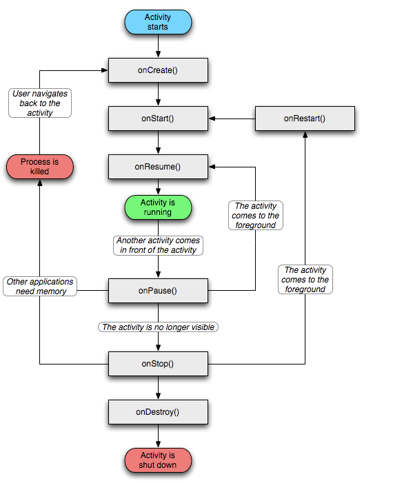

# 四大组件-Activity

## 一.AndroidManifest.xml初探

```
allowBackup:允许系统备份
icon:应用图标
label:应用名称
roundIcon:圆形图标android 8.0开始支持
supportsRtl:从左到右布局
theme:主题
```

设定程序的入口

```
<intent-filter>
   <action android:name="android.intent.action.MAIN" />

   <category android:name="android.intent.category.LAUNCHER" />
</intent-filter>
```


## 二.通过显式意图来控制界面跳转

1.创建一个SecondActivity文件，继承Activity，并创建activity_second.xml

2.在AndroidManifest.xml中注册SecondActivity

3.在activity_main.xml中添加登录界面相关组件（账号，账号输入框，密码，密码输入框）

4.在MainActivity中初始化部件,设置监听,创建意图内并往显式意图内put账号密码信息

```java
/**
 * 目标：
* 实现页面的跳转并且把数据传回另一个界面
*/
public class MainActivity extends AppCompatActivity {

    private EditText mAccount ;
    private EditText mPassword;
    private Button mLogin   ;

    @Override
    protected void onCreate(Bundle savedInstanceState) {
        super.onCreate(savedInstanceState);
        setContentView(R.layout.activity_main);

        initView();
        initListener();
    }

    private void initView() {
        mAccount = findViewById(R.id.account);
        mPassword = findViewById(R.id.password);
        mLogin   = findViewById(R.id.login);
    }

    private void initListener() {
        mLogin.setOnClickListener(new View.OnClickListener() {
            @Override
            public void onClick(View v) {
                handlerLogin();
            }
        });
    }

    private void handlerLogin() {
        String account = mAccount.getText().toString().trim();
        String password = mPassword.getText().toString().trim();

        //账号空判断
        if (TextUtils.isEmpty(account)) {
           Toast.makeText(this,"输入的账号为空",Toast.LENGTH_SHORT).show();
            return;
        }
        //密码空判断
        if (TextUtils.isEmpty(password)) {
           Toast.makeText(this,"输入的密码为空",Toast.LENGTH_SHORT).show();
            return;
        }

        //创建一个意图，用来跳转到SecondActivity界面!!!重要
        Intent intent = new Intent(this,SecondActivity.class);
        //通过putExtra传输数据!!!重要
        intent.putExtra("account",account);
        intent.putExtra("password",password);
        startActivity(intent);

    }

}
```

5.在activity_second.xml中添加相关部件来显示账号密码信息

6.在SecondActivity中编写获取和显示账号密码的代码

```java
public class SecondActivity extends Activity {
    private static final String TAG = "SecondActivity";

    @Override
    protected void onCreate(@Nullable Bundle savedInstanceState) {
        super.onCreate(savedInstanceState);
        setContentView(R.layout.activity_second);

        TextView info = findViewById(R.id.info);

        //获得传过来的意图
        Intent intent = getIntent();
        //获取账号密码
        String account = intent.getStringExtra("account");
        String password = intent.getStringExtra("password");
        Log.d(TAG, "账号===>>>>" + account);
        Log.d(TAG, "密码====>>>>" + password);
        //账号密码显示
        info.setText("账号:" + account + "密码:" + password);
    }
}
```


## 三.通过隐式意图来控制界面跳转

1.创建一个ThirdActivity文件，继承Activity，并创建activity_third.xml

2.在AndroidManifest.xml中注册ThirdActivity,并添加意图过滤器intent-filter

```xml
<activity android:name=".ThirdActivity">
            <intent-filter>
                <action android:name="com.cjc.LOGIN_INFO"/>
                <category android:name="android.intent.category.DEFAULT"/>
                <category android:name="android.intent.category.HOME"/>
            </intent-filter>
</activity>
```

3.在activity_main.xml中添加登录界面相关组件（账号，账号输入框，密码，密码输入框）

4.在MainActivity中初始化部件,设置监听,创建意图内并往隐式意图内put账号密码信息

```java
public class MainActivity extends AppCompatActivity {

    private EditText mAccount ;
    private EditText mPassword;
    private Button mLogin   ;

    @Override
    protected void onCreate(Bundle savedInstanceState) {
        super.onCreate(savedInstanceState);
        setContentView(R.layout.activity_main);

        initView();
        initListener();
    }

    private void initView() {
        mAccount = findViewById(R.id.account);
        mPassword = findViewById(R.id.password);
        mLogin   = findViewById(R.id.login);
    }

    private void initListener() {
        mLogin.setOnClickListener(new View.OnClickListener() {
            @Override
            public void onClick(View v) {
                handlerLogin();
            }
        });
    }

    private void handlerLogin() {
        String account = mAccount.getText().toString().trim();
        String password = mPassword.getText().toString().trim();

        //账号空判断
        if (TextUtils.isEmpty(account)) {
            Toast.makeText(this,"输入的账号为空",Toast.LENGTH_SHORT).show();
            return;
        }
        //密码空判断
        if (TextUtils.isEmpty(password)) {
            Toast.makeText(this,"输入的密码为空",Toast.LENGTH_SHORT).show();
            return;
        }

        //创建一个意图，用来跳转到SecondActivity界面!!!重要
        //通过putExtra传输数据
        //使用隐式意图!!!重要
        Intent intent = new Intent();
        intent.setAction("com.cjc.LOGIN_INFO");
        //intent.addCategory("android.intent.category.DEFAULT");
        intent.addCategory(Intent.CATEGORY_DEFAULT);
        intent.putExtra("account",account);
        intent.putExtra("password",password);
        startActivity(intent);

    }

}
```

5.在activity_third.xml中添加相关部件来显示账号密码信息(同上)


## Q:什么时候使用显式意图，什么时候使用隐式意图

显式意图一般用于应用内组件跳转，隐式意图一般用于应用之间的跳转


## 四.显式意图跳转到第三方应用（浏览器）

1.创建一个Skip2BrowserActivity文件，继承Activity，并创建activity_skip2browser.xml

2.在AndroidManifest.xml中注册Skip2BrowserActivity

3.在activity_skip2browser.xml中添加相关组件（跳转按钮）

4.在Skip2BrowserActivity中初始化部件,设置监听,创建意图内并往显式意图内添加跳转信息

```
adb shell "logcat | grep cmp" //获取应用Activity
```

```java
public class Skip2BrowserActivity extends Activity {

    private static final String TAG = "Skip2BrowserActivity";
    private Button mbutton;

    @Override
    protected void onCreate(@Nullable Bundle savedInstanceState) {
        super.onCreate(savedInstanceState);
        setContentView(R.layout.activity_skip2browser);
        initView();
        initListener();
    }

    private void initView() {
        mbutton = findViewById(R.id.button_skip2browser);
    }


    // cmp=org.chromium.webview_shell/.WebViewBrowserActivity
    private void initListener() {
        mbutton.setOnClickListener(new View.OnClickListener() {
            @Override
            public void onClick(View v) {
                Log.d(TAG, "onClick: Skip2BrowserActivity");
                Intent intent = new Intent();
                //第一种写法
                //intent.setClassName("org.chromium.webview_shell","org.chromium.webview_shell.WebViewBrowserActivity");

                //第二种写法
ComponentName componentName = new ComponentName("org.chromium.webview_shell","org.chromium.webview_shell.WebViewBrowserActivity");
                intent.setComponent(componentName);

                startActivity(intent);
            }
        });
    }
}
```


## 五.隐式意图跳转到第三方应用（浏览器）

1.创建一个Skip2BrowserActivity文件，继承Activity，并创建activity_skip2browser.xml

2.在AndroidManifest.xml中注册Skip2BrowserActivity

3.在activity_skip2browser.xml中添加相关组件（跳转按钮）

4.在Skip2BrowserActivity中初始化部件,设置监听,创建意图内并往显式意图内添加跳转信息

```java
public class Skip2BrowserActivity extends Activity {

    private static final String TAG = "Skip2BrowserActivity";
    private Button mbutton_visible;
    private Button mbutton_invisible;

    @Override
    protected void onCreate(@Nullable Bundle savedInstanceState) {
        super.onCreate(savedInstanceState);
        setContentView(R.layout.activity_skip2browser);
        initView();
        initListener();
    }

    private void initView() {
        mbutton_visible = findViewById(R.id.button_skip2browser_visible);
        mbutton_invisible = findViewById(R.id.button_skip2browser_invisible);
    }


    // cmp=org.chromium.webview_shell/.WebViewBrowserActivity
    private void initListener() {
        //显式意图跳转到浏览器
        mbutton_visible.setOnClickListener(new View.OnClickListener() {
            @Override
            public void onClick(View v) {
                Log.d(TAG, "onClick: Skip2BrowserActivityVisible");
                Intent intent = new Intent();
                //第一种写法
                //intent.setClassName("org.chromium.webview_shell","org.chromium.webview_shell.WebViewBrowserActivity");

                //第二种写法
                ComponentName componentName = new ComponentName("org.chromium.webview_shell","org.chromium.webview_shell.WebViewBrowserActivity");
                intent.setComponent(componentName);

                startActivity(intent);
            }
        });

        //隐式意图跳转到浏览器
        mbutton_invisible.setOnClickListener(new View.OnClickListener() {
            @Override
            public void onClick(View v) {
                Log.d(TAG, "onClick: Skip2BrowserActivityinVisible");
                Intent intent = new Intent();

                intent.setAction("android.intent.action.VIEW");
                intent.addCategory("android.intent.category.DEFAULT");
                intent.setData(Uri.parse("http://www.baidu.com"));
                startActivity(intent);
            }
        });
    }
}
```


## 六.界面之间的数据类型的传递

#### 1.基本数据类型


##### 基本数据类型发送:

第一个Activity内容

```java
Intent intent = new Intent(this, SecondActivity.class);
        intent.putExtra("booleanKey", true);
        intent.putExtra("charKey", 'a');
        intent.putExtra("byteKey", (byte) 1);
        intent.putExtra("shortKey", (short) 2);
        intent.putExtra("intKey", 3);
        intent.putExtra("longKey", 4l);
        intent.putExtra("floatKey", 0.5f);
        intent.putExtra("doubleKey", 0.6d);
        startActivity(intent);
```

##### 基本数据类型接收:

第二个Activity内容

```java
		/**
         * 拿到启动这个Activity的意图对象
         */
        Intent intent = getIntent();
        if (intent != null) {
            //前面的是key，后面的是默认值，假设获取不到的时候，就会返回默认值，也就是后面的那个值。
            //比如说我们把key写错了，这样子就获取不到值了。
            boolean booleanValue = intent.getBooleanExtra("booleanKey", false);
            //
            char charValue = intent.getCharExtra("charKey", '*');
            //
            byte byteValue = intent.getByteExtra("byteKey", (byte) 0);
            //
            short shortValue = intent.getShortExtra("shortKey", (short) 0);
            //
            int intValue = intent.getIntExtra("intKey", -1);
            //
            long longValue = intent.getLongExtra("longKey", 0l);
            //
            float floatValue = intent.getFloatExtra("floatKey", 0.0f);
            //
            double doubleValue = intent.getDoubleExtra("doubleKey", 0.0d);

            Log.d(TAG, "booleanValue = " + booleanValue);
            Log.d(TAG, "charValue = " + charValue);
            Log.d(TAG, "byteValue = " + byteValue);
            Log.d(TAG, "shortValue = " + shortValue);
            Log.d(TAG, "intValue = " + intValue);
            Log.d(TAG, "longValue = " + longValue);
            Log.d(TAG, "floatValue = " + floatValue);
            Log.d(TAG, "doubleValue = " + doubleValue);

        }
```

#### 2.引用数据类型的数据传输

String为引用数据类型，实现了序列号接口，依旧使用`  intent.putExtra()`进行传送

接收则使用 intent.getStringExtra();

亦可以使用intent.getSerializableExtra();进行接收;

```java
public class User implements Parcelable {
    private String name;
    private int age;

    public User(String name, int age) {
        this.age = age;
        this.name = name;
    }

    protected User(Parcel in) {
        name = in.readString();
        age = in.readInt();
    }

    public static final Creator<User> CREATOR = new Creator<User>() {
        @Override
        public User createFromParcel(Parcel in) {
            return new User(in);
        }

        @Override
        public User[] newArray(int size) {
            return new User[size];
        }
    };

    public void setName(String name) {
        this.name = name;
    }

    public void setAge(int age) {
        this.age = age;
    }

    public String getName() {
        return name;
    }

    public int getAge() {
        return age;
    }

    @Override
    public int describeContents() {
        return 0;
    }

    @Override
    public void writeToParcel(Parcel dest, int flags) {
        dest.writeString(name);
        dest.writeInt(age);
    }
}
```

如何传送自定义对象呢？

#### 3.自定义对象的传送

实现序列化接口Parcelable或者Serializable(前者更高效写进内存，后者写进存储单元)，实现或者继承相关方法

```java
public class User implements Parcelable {
    private String name;
    private int age;
    private float tall;

    public User() {
    }

    public User(String name, int age, float tall) {
        this.name = name;
        this.age = age;
        this.tall = tall;
    }

    protected User(Parcel in) {
        name = in.readString();
        age = in.readInt();
        tall = in.readFloat();
    }

    public static final Creator<User> CREATOR = new Creator<User>() {
        @Override
        public User createFromParcel(Parcel in) {
            return new User(in);
        }

        @Override
        public User[] newArray(int size) {
            return new User[size];
        }
    };

    public String getName() {
        return name;
    }

    public void setName(String name) {
        this.name = name;
    }

    public int getAge() {
        return age;
    }

    public void setAge(int age) {
        this.age = age;
    }

    public float getTall() {
        return tall;
    }

    public void setTall(float tall) {
        this.tall = tall;
    }

    @Override
    public int describeContents() {
        return 0;
    }

    @Override
    public void writeToParcel(Parcel dest, int flags) {
        dest.writeString(name);
        dest.writeInt(age);
        dest.writeFloat(tall);
    }

    @Override
    public String toString() {
        return "User{" +
                "name='" + name + '\'' +
                ", age=" + age +
                ", tall=" + tall +
                '}';
    }
}
```

接下来具体的传送实现:

##### 发送：

```java
Intent intent = new Intent(this,SecondActivity.class);

        User user = new User();
        user.setAge(3);
        user.setName("cc");
        user.setTall(181f);

        intent.putExtra("userKey",user);
        startActivity(intent);
```

##### 接收:

```java
			/* 传递对象 */
            User userKey = intent.getParcelableExtra("userKey");
         if (userKey != null) {
            Log.d(TAG, "username ===>>> " + userKey.getName());
            Log.d(TAG, "userage  ===>>> " + userKey.getAge());
            Log.d(TAG, "usertall ===>>> " + userKey.getTall());
            Log.d(TAG, "userKey  ===>>> " + userKey);
         }
```

#### 4.协议的形式来传数据

##### 示例1，(危险权限获取)通过隐式意图来传送数据(调用系统电话)

```
/* android6.0危险权限需要进行申请
* PackageManager.PERMISSION_GRANTED为有权限，PackageManager.PERMISSION_DENIED为无权限
*
* 步骤：
* 若电话无权限,则通过ActivityCompat.requestPermissions申请权限，若有权限，则实现相关方法
* 调用完requestPermissions后弹出权限对话框，询问是否允许权限
* 再调用onRequestPermissionsResult
* 若同意了权限则会将权限加入再调用onRequestPermissionsResult方法的grantResults中
* 若同意权限则实现相关业务，反之提示需要权限
*  */
```


```java
    //点击按钮
	mbuttongo2dial.setOnClickListener(new View.OnClickListener() {
            @Override
            public void onClick(View v) {
                if (ContextCompat.checkSelfPermission(MainActivity.this,
                        Manifest.permission.CALL_PHONE)!= PackageManager.PERMISSION_GRANTED) {
                    ActivityCompat.requestPermissions(MainActivity.this,new
                            String[]{Manifest.permission.CALL_PHONE},1);
                }else {
                    handlerIntent2Dial();
                }

            }
        });
```


```java
	/* 打电话给10086 */
    private void handlerIntent2Dial() {
        Intent intent = new Intent();
        //intent.setAction("android.intent.action.CALL");
        //上面可以写成下面这种
        intent.setAction(Intent.ACTION_CALL);
        intent.addCategory("android.intent.category.DEFAULT");

        Uri uri = Uri.parse("tel:10086");
        intent.setData(uri);
        startActivity(intent);
    }
```


```java
@Override
    public void onRequestPermissionsResult(int requestCode, @NonNull String[] permissions, @NonNull int[] grantResults) {
        switch (requestCode){
            case 1:
                if (grantResults.length > 0 && grantResults[0] == PackageManager.PERMISSION_GRANTED){
                    handlerIntent2Dial();
                }else {
                    Toast.makeText(this,"请先允许权限",Toast.LENGTH_SHORT).show();
                }
                break;
            default:
                super.onRequestPermissionsResult(requestCode,permissions,grantResults);
        }
    }
```


##### 示例2，通过隐式意图来传送数据(模拟发短信)

Activity过滤器:

```
        <activity android:name=".SendMsgActivity"
            android:exported="true">
            <intent-filter>
                <action android:name="com.cjc.componentdatadeliver.SEND_MSG"/>
                <category android:name="android.intent.category.DEFAULT"/>
                <data android:scheme="msg"/>
            </intent-filter>
        </activity>
```


发送:

```java
        Intent intent = new Intent();

        intent.setAction("com.cjc.componentdatadeliver.SEND_MSG");
        intent.addCategory(Intent.CATEGORY_DEFAULT);
        intent.putExtra("targetNumberKey","10086");

        //Scheme:msg后面的内容
        Uri uri = Uri.parse("msg:你好，小帅哥");
        intent.setData(uri);

        startActivity(intent);
```

接收:

```java
Intent intent = getIntent();
        if (intent != null) {
            String targetNumber = intent.getStringExtra("targetNumberKey");
            Log.d(TAG, "targetNumber===>>> " + targetNumber);
            receiver_phone_number.setText(targetNumber);
            //getData:自动传过来
            Uri data = intent.getData();
            Log.d(TAG, "data===>>> " + data);
            if (data != null) {
                String content = data.toString().replace("msg:", "");
                message_content.setText(content);
            }
        }
```


##### 小知识:

Intent封装数据的大小限制:1M


### 七.数据回传

##### 实例1：充值界面

数据回传需要使用到requestCode和resultCode,重写onActivityResult方法来回调

示例：点击跳转到充值界面，打开充值界面，输入金额点金确定充值或者返回金额

点击确定则再上一个界面回传充值成功，失败则是回传充值失败


代码：

```java
public class MainActivity extends AppCompatActivity {

    private Button btn_pay;
    private TextView tv_pay_result;
    private Context context;

    //请求码
    private static final int PAY_REQUEST_CODE = 1;

    @Override
    protected void onCreate(Bundle savedInstanceState) {
        super.onCreate(savedInstanceState);
        setContentView(R.layout.activity_main);

        context = getApplicationContext();

        initView();
        initListener();


    }


    private void initView() {
        btn_pay = findViewById(R.id.btn_pay);
        tv_pay_result = findViewById(R.id.tv_pay_result);
    }

    private void initListener() {
        btn_pay.setOnClickListener(new View.OnClickListener() {
            @Override
            public void onClick(View v) {
                Intent intent = new Intent(context,PayActivity.class);

                //1:设置startActivityForResult代替startActivity
                startActivityForResult(intent,PAY_REQUEST_CODE);
            }
        });
    }

    @Override
    protected void onActivityResult(int requestCode, int resultCode, @Nullable Intent data) {
        super.onActivityResult(requestCode, resultCode, data);
        //在这里会返回充值界面返回的数据
        if (requestCode == PAY_REQUEST_CODE) {
            String resultContent = null;
            if (resultCode == 2) {
                //充值成功
                resultContent = data.getStringExtra("resultContent");
            }else if (resultCode == 3){
                //充值失败
                resultContent = data.getStringExtra("resultContent");
            }
            tv_pay_result.setText(resultContent);       
        }
    }
}
```


```java
public class PayActivity extends AppCompatActivity {

    private EditText et_pay_input;
    private Button btn_pay2;
    private Button btn_pay_cancel;
    private Context context;

    @Override
    protected void onCreate(Bundle savedInstanceState) {
        super.onCreate(savedInstanceState);
        setContentView(R.layout.activity_pay);
        initView();
        initListener();
        context = getApplicationContext();
    }


    private void initView() {
        et_pay_input = findViewById(R.id.et_pay_input);
        btn_pay2 = findViewById(R.id.btn_pay2);
        btn_pay_cancel = findViewById(R.id.btn_pay_cancel);
    }

    private void initListener() {

        btn_pay2.setOnClickListener(new View.OnClickListener() {
            @Override
            public void onClick(View v) {
                handlerpay();
            }
        });

        btn_pay_cancel.setOnClickListener(new View.OnClickListener() {
            @Override
            public void onClick(View v) {
                handlerCancel();
            }
        });

    }

    private void handlerpay() {
        String paynumber = et_pay_input.getText().toString().trim();
        if (TextUtils.isEmpty(paynumber)) {
            Toast.makeText(context,"请输入金额",Toast.LENGTH_SHORT).show();
            return;
        }

        //进行充值

        Intent intent = new Intent();
        intent.putExtra("resultContent","充值成功");
        setResult(2,intent);
        finish();
    }
    
    private void handlerCancel() {
        Intent intent = new Intent();
        intent.putExtra("resultContent","充值失败");
        setResult(3,intent);
        finish();
    }


}
```

#### 

##### 实例2：相机调用及相机照片的返回

```java
public class MainActivity extends AppCompatActivity {

    private static final int REQUEST_CODE = 1;
    private ImageView resultContainer;
    private ImageView takephotobtn;

    @Override
    protected void onCreate(Bundle savedInstanceState) {
        super.onCreate(savedInstanceState);
        setContentView(R.layout.activity_main);

        initView();
        initListener();
    }


    private void initView() {
        resultContainer = findViewById(R.id.iv_photo_result);
        takephotobtn = findViewById(R.id.take_photo);
    }

    private void initListener() {
        takephotobtn.setOnClickListener(new View.OnClickListener() {
            @Override
            public void onClick(View v) {
                if (ContextCompat.checkSelfPermission(MainActivity.this,
                        Manifest.permission.CAMERA)!= PackageManager.PERMISSION_GRANTED) {
                    ActivityCompat.requestPermissions(MainActivity.this,
                            new String[]{Manifest.permission.CAMERA},1);
                }else {
                    handlertakephoto();
                }

            }
        });
    }

    @Override
    public void onRequestPermissionsResult(int requestCode, @NonNull String[] permissions, @NonNull int[] grantResults) {
        super.onRequestPermissionsResult(requestCode, permissions, grantResults);
        if (requestCode == 1) {
            if (grantResults.length > 0 && grantResults[0] == PackageManager.PERMISSION_GRANTED) {
                handlertakephoto();
            }else {
                Toast.makeText(this,"请先允许权限",Toast.LENGTH_SHORT).show();
            }
        }
    }

    private void handlertakephoto() {
        //拍照按钮点击后跳转到相机界面
        //startActivityForResult
        Intent intent = new Intent();
        intent.setAction("android.media.action.IMAGE_CAPTURE");
        intent.addCategory(Intent.CATEGORY_DEFAULT);


        startActivityForResult(intent, REQUEST_CODE);
    }

    @Override
    protected void onActivityResult(int requestCode, int resultCode, @Nullable Intent data) {
        super.onActivityResult(requestCode, resultCode, data);
        if (requestCode == REQUEST_CODE) {
            if (resultCode == Activity.RESULT_OK && data!=null) {
                //说明成功返回
                Bitmap result = data.getParcelableExtra("data");
                if (result != null) {
                    resultContainer.setImageBitmap(result);
                }

            }else if (resultCode == Activity.RESULT_CANCELED){
                //取消或者失败
                Toast.makeText(this,"您取消了拍照",Toast.LENGTH_SHORT).show();
            }
        }

    }
}
```


## 七.生命周期

##### 1.生命周期

生命周期:被创建—->被开始—>被可视—–>被暂停—–>被停止——>被销毁



`1.onCreate：onCreate这个方法会在Activity启动的时候被调用。集成自Activity的类，实现了onCreate方法，必须要调用 super.onCreate(savedInstanceState)这个方法，否则会抛出异常。`

`2.onStart:这个方法会在onCreate方法以后调用，或者会在onRestart这个方法调用以后被调用`


`3.onResume:获得焦点时，这个方法会在onRestoreInstanceState方法或者onRestart方法或者onPause这个方法以后被调用。`

`4.onPause:失去焦点时,它会在当前Activity进入后台但又没被杀死的时候会被调用`

`5.onStop:界面不可见时，停止的回调，这个方法一般是执行完onPause,要退出了，则会调用。假设说，顶部有一个透明的Activity，则不会调用当前的onStop方法，但会调用到onPause方法`

`6.onDestroy:活动销毁时`

##### 2.横竖屏对生命周期的影响

```
横竖屏时生命周期的变化:打开应用，竖屏—>横屏
D/MainActivity: onCreate:
D/MainActivity: onStart:
D/MainActivity: onResume:
D/MainActivity: onPause:
D/MainActivity: onStop:
D/MainActivity: onDestroy:
D/MainActivity: onCreate:
D/MainActivity: onStart:
D/MainActivity: onResume:

如上可知竖屏切换成横屏的时候，Activity会销毁，并重新创建
横屏切换成竖屏时Activity也会销毁，并重新创建
实际开发的场景：
1.游戏开发
2.视频播放器
3.其他场景
横竖屏切换的时候，activity的生命周期发生变化
如何解决？
1.禁止旋转，指定方向(大多用于游戏)
android:screenOrientation="landscape" 横屏
android:screenOrientation="portrait"  竖屏
2.对配置不敏感(大多用于视频app)
android:configChanges="keyboardHidden|screenSize|orientation"

```


##### 3.任务栈和启动模式

```
任务栈：先进后出
队列：先进后出

1.standard模式：android:launchMode="standard"
创建新的任务，置于栈顶。当我们返回的时候，就是销毁当前任务，也就是出栈
创建了多少个，就点多少次返回
使用场景：大多数场景，如果不配置，默认就是用此模式
2.singleTop模式: android:launchMode="singleTop"
如果栈顶已经是当前任务了，就不会创建新任务
使用场景：一般来说，为保证只有一个任务，而不被创建多个，所有就需要这种模式
比如我们的浏览器书签，应用通知推送
3.singleTask模式: android:launchMode="singleTask"
如果要创建的任务没有，就会创建任务，并且放在栈顶
如果要创建的任务已经存在，就会把这个任务以上的任务全部移除，
使得当前任务成为最顶部的任务
使用场景:当任务占的资源比较大时，就使用singleTask
4.singleInstance模式: android:launchMode="singleInstance"
singleInstance的特点：前面三种启动模式，都在同一个任务栈，
但是singleInstance很特别，他是独立一个任务栈
使用场景：在整个系统中只有一个唯一实例。
```


>代码参考：阳光沙滩-程序猿拉大锯

[阳光沙滩](https://www.sunofbeach.net/)

[程序猿拉大锯的bilibili空间](https://space.bilibili.com/44272436)