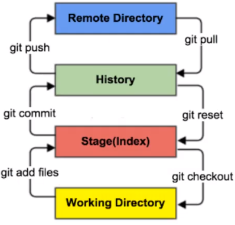
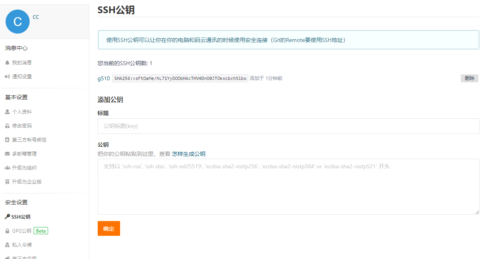
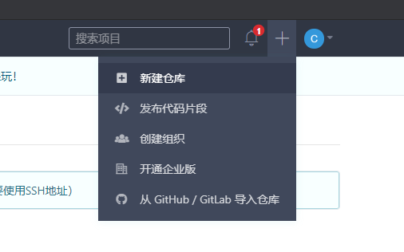

# Git学习

### 1.常用的Linux命令

```
1) cd: 改变目录
2) cd ..: 回退到上一个目录 
3) pwd: 显示当前所在目录路径
4) ls(ll): 列出当前目录的所有文件ll更为详细
5) touch: 新建一个文件 比如：touch index.js 就会在当前目录创建index.js文件
6) rm: 删除一个文件,rm index.js 就会把index.js删除
7) mkdir: 新建一个文件夹
8) rm -r: 删除一个文件夹
9) mv: 移动文件, mv index.html src (index.html是要移动的文件，src是目标文件夹)
10) reset: 重新初始化终端/清屏
11) clear: 清屏
12) history: 查看历史命令
13) help: 帮助
14) exit: 退出
15) #: 表示注释

```

```
git config -l: 查看所有配置
git config --system --list: 查看系统配置
git config --global --list: 查看用户配置
```

git配置文件在git安装目录下的etc文件夹下的gitconfig文件内

> 初次使用git需配置用户信息

git的用户配置文件在C:/用户/用户名/.gitconfig 文件内

````shell
git config --global user.name "username" #名称
git config --global user.email "xxx@xx.com" #邮箱
````


### 2.Git基本理论（核心）

>工作区域

Git本地有三个工作区域：工作目录（Working Directory），暂存区（Stage/Index），资源库（Repository或者Git Repository）。如果再加上远程的Git仓库（Remote Directory）就可以分为四个工作区域。文件正在这四个区域之间转换关系如下：



> Git工作流程

1.在工作目录中添加，修改文件； 

2.将需要进行版本管理的文件放入暂存区域； `git add .`

3.将暂存区文件提交到仓库  `git commit`

4.从仓库提交到远端仓库 `git push`


### 3.具体步骤

#### 1.本地仓库搭建

创建本地仓库的方法有两种：一种是创建全新的仓库，一种是克隆远程仓库

1.创建全新的仓库,需要用Git管理的项目的根目录执行，执行后可以看到项目目录多了个.git目录

```shell
# 在当前目录新建一个Git代码仓库
$ Git init
```

2.克隆远程目录，从远程服务器上的仓库备份下来

```shell
git clone [url] https://gitee.com/kuangstudy/openclass.git
```


#### 2.文件的四种状态

> 文件的四种状态

版本控制就是对文件的版本控制，要对文件进行修改、提交等操作，首先要知道文件当前在什么状态，不然可能会提交了现在还不想提交的文件，或者要提交的文件没提交上。

- Untracked: 未跟踪, 此文件在文件夹中, 但并没有加入到git库, 不参与版本控制. 通过git add 状态变为Staged.
- Unmodify: 文件已经入库, 未修改, 即版本库中的文件快照内容与文件夹中完全一致. 这种类型的文件有两种去处, 如果它被修改, 而变为Modified. 如果使用git rm移出版本库, 则成为Untracked文件
- Modified: 文件已修改, 仅仅是修改, 并没有进行其他的操作. 这个文件也有两个去处, 通过git add可进入暂存staged状态, 使用git checkout 则丢弃修改过, 返回到unmodify状态, 这个git checkout即从库中取出文件, 覆盖当前修改 !
- Staged: 暂存状态. 执行git commit则将修改同步到库中, 这时库中的文件和本地文件又变为一致, 文件为Unmodify状态. 执行git reset HEAD filename取消暂存, 文件状态为Modified

>查看文件状态

上面说文件有4种状态，通过如下命令可以查看到文件的状态：

```shell
# 查看指定文件状态
git status [filename]

# 查看所有文件状态
git status

# git add .       添加所有文件到暂存区
# git commit -m   提交暂存区的中的内容到本地仓库   -m 提交信息
```


#### 3.忽略文件

>忽略文件

有些时候我们不想把某些文件纳入版本控制中，比如数据库文件，临时文件，设计文件等

在主目录下建立".gitignore"文件，此文件有如下规则：

1. 忽略文件中的空行或以井号（#）开始的行将会被忽略。

2. 可以使用Linux通配符。例如：星号（*）代表任意多个字符，问号（？）代表一个字符，方括号（[abc]）代表可选字符范围，大括号（{string1,string2,...}）代表可选的字符串等。

3. 如果名称的最前面有一个感叹号（!），表示例外规则，将不被忽略。

4. 如果名称的最前面是一个路径分隔符（/），表示要忽略的文件在此目录下，而子目录中的文件不忽略。

5. 如果名称的最后面是一个路径分隔符（/），表示要忽略的是此目录下该名称的子目录，而非文件（默认文件或目录都忽略）。

   

```shell
#为注释
*.txt        #忽略所有 .txt结尾的文件,这样的话上传就不会被选中！
!lib.txt     #但lib.txt除外
/temp        #仅忽略项目根目录下的TODO文件,不包括其它目录temp
build/       #忽略build/目录下的所有文件
doc/*.txt    #会忽略 doc/notes.txt 但不包括 doc/server/arch.txt
```


### 4.使用码云,github

#### 1.设置本机绑定SSH公钥

1.设置本机绑定SSH公钥，实现免密码登录

```shell
# 进入 C:\Users\Administrator\.ssh 目录
# 生成公钥
ssh-keygen -t rsa
```

2.将公钥信息public key 添加到码云账户中即可！



4、使用码云创建一个自己的仓库！

