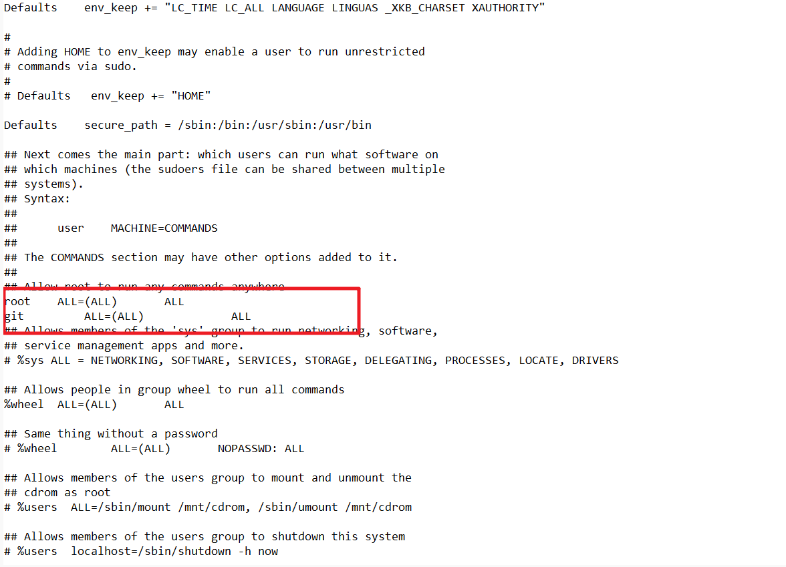
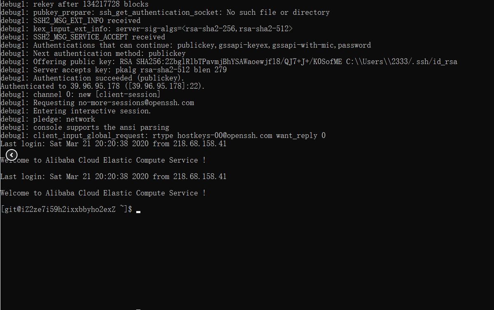

在一番折腾下，终于把博客部署到阿里云。

### 1.1安装git以及配置仓库

安装git以及新建git用户

```
copyyum install git

adduser git

chmod 740 /etc/sudoers

vi /etc/sudoers
```

在如下位置添加

```
copygit ALL=(ALL) ALL
```

vi指令执行之后按i进入输入模式，编辑完成之后按一下esc，然后输入:wq即可退出。


执行以下指令更改文件夹权限

```
copychmod 400 /etc/sudoers

sudo passwd git
```

切换git用户并且建立密钥

```
copysu git

cd ~

mkdir .ssh

cd .ssh

vi authorized_keys

chmod 600 ~/.ssh/authorized_keys

chmod 700 ~/.ssh
```

创建git仓库

```
copycd ~

git init --bare blog.git

vi ~/blog.git/hooks/post-receive
```

输入

```
copygit --work-tree=/home/www/website --git-dir=/home/git/blog.git checkout -f
```

保存退出

```
copychmod +x ~/blog.git/hooks/post-receive
```

*以上指令都需要在su git 之后执行 如果中途断开重新连接过，需要重新执行 su git指令 进入git账户。

新建/home/www/website文件夹,在root用户下执行，所限先su root切换为root账户。

```
copysu root

输入密码

cd /home

mkdir www

cd www

mkdir website

修改文件夹权限 这步很重要 视频中没有提及

chmod 777 /home/www/website

chmod 777 /home/www
```

在本地电脑输入

```
copyssh -v git@服务器的公网ip
```

返回如下则成功

修改本地配置文件

repo: git@这里改为服务器公网IP:/home/git/blog.git

### 2.1配置Nginx

```
copy此时ssh工具断开服务器重新连接，进入Linux账户
```

这里选用宝塔面板来一键部署Nginx，Linux面板6.0安装命令(暂时仅兼容Centos7.x，其它系统版本请安装5.9稳定版)：

```
copyyum install -y wget && wget -O install.sh http://download.bt.cn/install/install_6.0.sh && bash install.sh
```

Linux面板6.0升级专业版

```
copycurl http://download.bt.cn/install/update6.sh|bash
```

安装完成后会显示面板后台地址·账号·密码。打开面板后台地址登陆面板，选择Nginx的部署方案，静静等待部署。
部署完成，点击网站-添加站点-输入域名(没有域名的输入自己的IP地址)-底部的PHP版本选择”纯静态”(其他不改
或者根据自己的习惯来改)-提交。
网站创建完成后点击设置-配置文件

```
copyserver
{
    listen 80;
    # server_name 填写自己的域名(若没有可不填)
    server_name ali6.cn blog.ali6.cn;
    index index.php index.html index.htm default.php default.htm default.html;
    # 这里root填写自己的网站根目录，修改为/home/www/website
    root /home/www/website;
```

至此，服务器端的部署已经全部完成

下面开始测试部署

本地git执行如下命令

```
copyhexo clean

hexo g -d
```

------

#### 参考文档

> **https://lneverl.gitee.io/posts/2092ec56.html**

> **https://yq.aliyun.com/articles/702417**